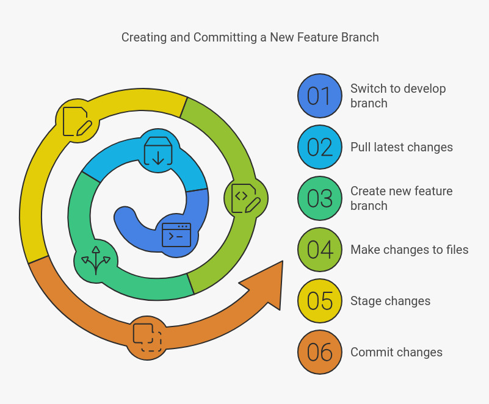
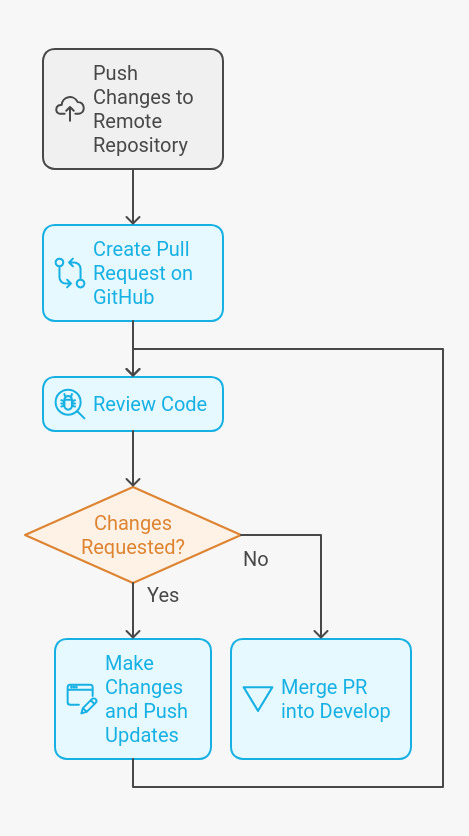

# Git Workflow for Collaboration
---

---

This guide outlines a Git workflow for collaborating on a project with a team. It covers branching, pull requests, code reviews, and merging changes.

## Table of Contents
1. [Setting Up the Repository](#1-setting-up-the-repository)
2. [Create a New Feature Branch](#2-create-a-new-feature-branch)
3. [Pushing Your Changes](#3-pushing-your-changes)
4. [Opening a Pull Request (PR)](#4-opening-a-pull-request-pr)
5. [Review Process](#5-review-process)
6. [Merging the Feature Branch](#6-merging-the-feature-branch)
7. [Keeping Your Branch Updated](#7-keeping-your-branch-updated)
8. [Deploying to main](#8-deploying-to-main)
9. [Hotfix Workflow](#9-hotfix-workflow)

---

## 1. Setting Up the Repository
Before starting, make sure you and your teammate have cloned the repository:

```bash
git clone https://github.com/your-user/your-project.git
cd your-project
```

## 2. Create a New Feature Branch
Whenever you start working on a new feature, create a new branch from `develop`.

**Example: Starting a login feature.**

1. Switch to the `develop` branch to ensure you're up-to-date:
   ```bash
   git checkout develop
   git pull origin develop
   ```

2. Create a new feature branch:
   ```bash
   git checkout -b feature/login
   ```

3. Make changes and commit:
   ```bash
   # After editing files
   git add .
   git commit -m "feat: add user login functionality"
   ```



## 3. Pushing Your Changes
Once you're ready, push your feature branch to the remote repository:

```bash
git push origin feature/login
```

## 4. Opening a Pull Request (PR)
When your feature is ready, open a Pull Request (PR) to merge `feature/login` into `develop`.

- Navigate to GitHub and open a PR.
- Provide a clear description of what the feature adds or fixes.

## 5. Review Process
Your teammate will review your changes by checking out your branch:

```bash
git fetch origin feature/login
git checkout feature/login
```

After review:
- If feedback is needed, make changes, and push more commits:
  ```bash
  git add .
  git commit -m "fix: address PR feedback"
  git push origin feature/login
  ```

- Once approved, the PR can be merged into `develop`.

## 6. Merging the Feature Branch
After the PR is approved, merge it into `develop`.

**Option 1: Using GitHub**  
Merge the PR using the "Merge pull request" button.

**Option 2: Merging locally:**

1. Switch to `develop`:
   ```bash
   git checkout develop
   git pull origin develop
   ```

2. Merge the feature branch:
   ```bash
   git merge feature/login
   ```

3. Push the updated `develop` branch:
   ```bash
   git push origin develop
   ```



## 7. Keeping Your Branch Updated
If you're working on a branch while the PR is being reviewed, keep it up-to-date with `develop`:

```bash
git checkout feature/login
git pull origin develop
# Resolve conflicts if needed, then:
git add .
git commit -m "fix: resolve merge conflicts"
git push origin feature/login
```

## 8. Deploying to main
When the `develop` branch is stable and ready for release, merge it into `main`:

1. Switch to `main`:
   ```bash
   git checkout main
   git pull origin main
   ```

2. Merge `develop` into `main`:
   ```bash
   git merge develop
   ```

3. Push the updated `main` branch:
   ```bash
   git push origin main
   ```

4. Optionally, create a release tag:
   ```bash
   git tag v1.0.0
   git push origin v1.0.0
   ```

## 9. Hotfix Workflow
For urgent fixes in `main`, follow this hotfix process:

1. Checkout the `main` branch:
   ```bash
   git checkout main
   git pull origin main
   ```

2. Create a hotfix branch:
   ```bash
   git checkout -b hotfix/urgent-fix
   ```

3. Fix the issue, commit, and push:
   ```bash
   git add .
   git commit -m "fix: resolve urgent production bug"
   git push origin hotfix/urgent-fix
   ```

4. Merge the hotfix into `main`:
   ```bash
   git checkout main
   git merge hotfix/urgent-fix
   git push origin main
   ```

5. Merge the hotfix into `develop` to keep both branches in sync:
   ```bash
   git checkout develop
   git merge hotfix/urgent-fix
   git push origin develop
   ```

---

This workflow ensures smooth collaboration, with stable branches and an organized development process.

